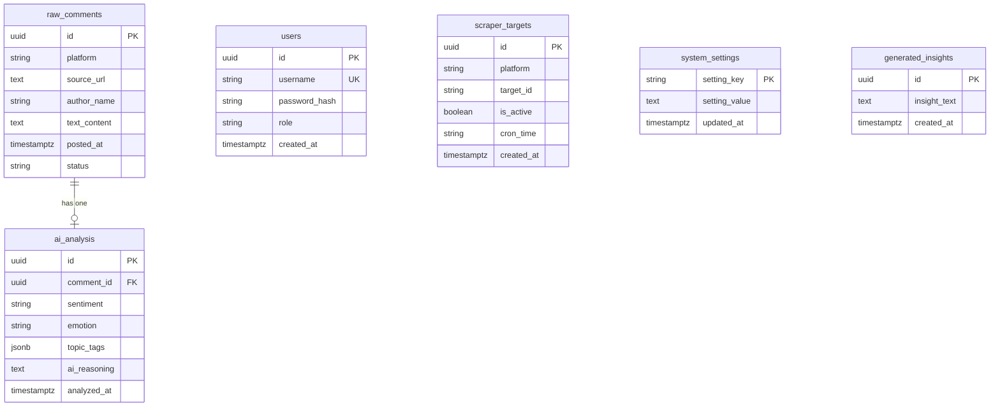

# Skema Database & Relasi — SI SORA

**Nama Sistem:** SI SORA (Sistem Informasi Social Opinion Reaction Analytics)  
**Database Engine:** PostgreSQL (Version 15+)  
**Driver ORM:** SQLAlchemy 2.0 (AsyncPG)  
**Pola Desain:** Asynchronous Non-Blocking dengan UUIDv4 & JSONB  
**Infrastruktur Cloud:** Supabase Cloud (`si-sora-db` di Singapore `ap-southeast-1`)  

---

## 1. Diagram Relasi Entitas (ERD)

---

## 2. Rincian Struktur Tabel

### A. Tabel `raw_comments`
Menyimpan komentar mentah yang ditarik oleh modul *crawler/scraper* dari berbagai platform digital publik sebelum dianalisis oleh AI.

| Kolom | Tipe Data | Keterangan |
| :--- | :--- | :--- |
| `id` | `UUID` (Primary Key) | Pengenal unik komentar berbasis `uuid.uuid4`. |
| `platform` | `VARCHAR(50)` | Asal platform (contoh: `youtube`, `playstore`, `tiktok`). |
| `source_url` | `TEXT` | Tautan langsung menuju konten/video sumber komentar. |
| `author_name` | `VARCHAR(100)` | Nama anonim atau nama akun publik pengirim komentar. |
| `text_content` | `TEXT` | Isi pesan atau ulasan opini publik. |
| `posted_at` | `TIMESTAMPTZ` | Waktu asli komentar diunggah oleh masyarakat. |
| `status` | `VARCHAR(20)` | Status pemrosesan data: `UNPROCESSED` atau `PROCESSED`. |

### B. Tabel `ai_analysis`
Menampung hasil inferensi AI `openai/gpt-oss-20b` melalui Groq API yang terhubung secara *One-to-One* ke tabel `raw_comments`.

| Kolom | Tipe Data | Keterangan |
| :--- | :--- | :--- |
| `id` | `UUID` (Primary Key) | Pengenal unik analisis berbasis `uuid.uuid4`. |
| `comment_id` | `UUID` (Foreign Key) | Relasi ke `raw_comments.id` dengan aturan `ON DELETE CASCADE`. |
| `sentiment` | `VARCHAR(20)` | Klasifikasi 3 arah: `positif`, `negatif`, atau `netral`. |
| `emotion` | `VARCHAR(50)` | Label emosi psikologis (contoh: `senang`, `kecewa`, `bingung`, `marah`). |
| `topic_tags` | `JSONB` | Array kata kunci/topik dalam format JSONB PostgreSQL. |
| `ai_reasoning` | `TEXT` | Penjelasan logis mengapa AI memberikan klasifikasi tersebut. |
| `analyzed_at` | `TIMESTAMPTZ` | Waktu saat pemrosesan inferensi AI selesai dieksekusi. |

### C. Tabel `users`
Menyimpan data otentikasi pengelola dan pimpinan yang memiliki hak akses operasional SI SORA.

| Kolom | Tipe Data | Keterangan |
| :--- | :--- | :--- |
| `id` | `UUID` (Primary Key) | Pengenal unik akun pengguna. |
| `username` | `VARCHAR(50)` | Username akun (bersifat unik dan terindeks). |
| `password_hash` | `VARCHAR(255)` | Sandi terenkripsi menggunakan algoritma `bcrypt`. |
| `role` | `VARCHAR(20)` | Tingkat wewenang: `ADMIN` (akses penuh) atau `VIEWER` (hanya membaca). |
| `created_at` | `TIMESTAMPTZ` | Waktu akun pertama kali didaftarkan. |

### D. Tabel `scraper_targets`
Menampung konfigurasi target URL atau ID channel/aplikasi yang akan ditarik secara berkala oleh scheduler.

| Kolom | Tipe Data | Keterangan |
| :--- | :--- | :--- |
| `id` | `UUID` (Primary Key) | Pengenal unik konfigurasi target. |
| `platform` | `VARCHAR(20)` | Jenis platform sumber target. |
| `target_id` | `VARCHAR(255)` | ID Video, ID Channel YouTube, atau Package ID Play Store. |
| `is_active` | `BOOLEAN` | Penanda apakah target aktif dalam jadwal penarikan otomatis. |
| `cron_time` | `VARCHAR(20)` | Format string jadwal penarikan (default: `02:00`). |
| `created_at` | `TIMESTAMPTZ` | Waktu konfigurasi ditambahkan. |

### E. Tabel `system_settings`
Menyimpan konfigurasi sistem berbasis *key-value store*.

| Kolom | Tipe Data | Keterangan |
| :--- | :--- | :--- |
| `setting_key` | `VARCHAR(100)` (Primary Key) | Kunci konfigurasi sistem. |
| `setting_value` | `TEXT` | Nilai konfigurasi dalam bentuk string atau JSON. |
| `updated_at` | `TIMESTAMPTZ` | Waktu terakhir konfigurasi diperbarui. |

### F. Tabel `generated_insights`
Menyimpan riwayat narasi kesimpulan eksekutif yang di-generate oleh AI untuk pimpinan.

| Kolom | Tipe Data | Keterangan |
| :--- | :--- | :--- |
| `id` | `UUID` (Primary Key) | Pengenal unik rekaman insight. |
| `insight_text` | `TEXT` | Narasi kesimpulan komprehensif dari seluruh sentimen publik. |
| `created_at` | `TIMESTAMPTZ` | Waktu insight diproduksi oleh sistem. |

---

## 3. Strategi Pengindeksan & Performa Query

1. **Unique Index Username:** Kolom `users.username` diindeks secara unik untuk mempercepat proses verifikasi login OAuth2 (`WHERE username = :val`).
2. **Foreign Key Indexing:** Relasi `ai_analysis.comment_id` ke `raw_comments.id` memastikan query `JOIN` untuk analitik agregasi berjalan instan.
3. **JSONB Indexing:** Kolom `topic_tags` menggunakan tipe data asli `JSONB` yang mendukung pencarian topikal berbasis operator `@>` tanpa membebani CPU.

---

## 4. Konfigurasi Driver & Supabase Connection Pooler

Untuk menjamin kestabilan koneksi antara Vercel Serverless dan Supabase Cloud, konfigurasi pada `backend/app/db/session.py` menerapkan standar baku berikut:

1. **Supavisor Transaction Pooler (Port 6543):** Digunakan untuk menghindari batas maksimum koneksi langsung PostgreSQL pada arsitektur serverless yang dapat men-scale banyak instance secara simultan.
2. **Statement Cache Zeroing:** Mengatur `statement_cache_size = 0` dan `prepared_statement_cache_size = 0` karena driver asyncpg secara default menggunakan prepared statement yang tidak didukung dalam mode *Transaction Pooling* Supavisor.
3. **Koneksi Resilien (`pool_pre_ping=True` & `pool_recycle=300`):** SQLAlchemy secara otomatis memvalidasi keaktifan koneksi sebelum mengeksekusi query, mencegah error *connection closed* saat kontainer serverless bangun dari keadaan idle.
4. **SSL Context `CERT_NONE`:** Mengaktifkan enkripsi SSL tanpa validasi sertifikat CA lokal, sesuai kebutuhan koneksi remote Supabase cloud.
